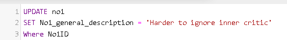
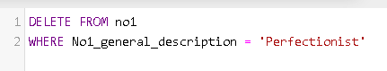
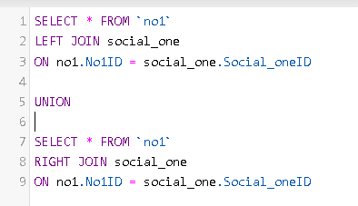

# SQL - Operations

Below are some SQL operations that I made in my Database.

-----------------

## CRUD Operations

## Insert

 

-----------------

## Select 

 
 

-----------------

## Update  

 

-----------------

## Delete

 

-----------------

# Joins

## Left Join
 

-----------------

## Right Join

 

-----------------
## Union Join 

 

-----------------

